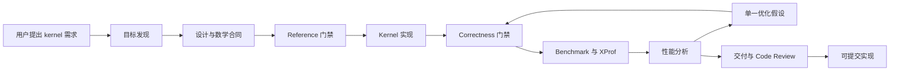

# Kernel Develop Skills

一套面向 JAX/Pallas/TPU/GPU kernel 的工程能力层。目标不是让模型遵守更多文字，而是让它同时成为：

- **Builder**：从已确认的算子契约实现正确、可集成的新 kernel。
- **Investigator**：从 correctness、benchmark、HLO 与 XProf 证据定位问题。
- **Learning system**：把已确认失败编译成 guardrail、fuzz case 和 replay eval，让下一次开发可测量地更可靠。

远程 kernel 仓库中的 `AGENTS.md`、CI 和项目约定始终是最高权威；本仓库的 skill 不能替代它们。

## 能力结构

| Skill | 职责 | 典型触发 |
| --- | --- | --- |
| `kernel-dev-lifecycle` | 总路由、硬门禁与最终交付验收 | 新 kernel、修复、优化、端到端任务 |
| `kernel-goal-discovery` | 只消除会改变实现方向的未知项 | 语义、shape、dtype、reference 或硬件不清楚 |
| `kernel-design-docs` | 用项目模板形成最小且可执行的 RFC/语义契约 | 新 kernel、API/数学/分布式语义或架构变化 |
| `implement-kernel-from-plan` | 从已确认契约实现或修改 kernel | 设计与 oracle 已确定 |
| `analyze-kernel` | correctness 与性能证据分析 | 诊断、基线比较、瓶颈判断 |
| `profile-pallas-xprof` | 按需采集并验证 XProf 证据 | 组件耗时、通信重叠、短 kernel 或证据歧义 |
| `kernel-tuning-loop` | 单次可归因优化或有预算的重复调优 | 一个或多个可证伪优化假设 |
| `kernel-foundry` | guardrail、fuzz、research、replay、portfolio、causal、genome | 重复开发和系统学习 |

`optimize-kernel-from-evidence` 已合并进 `kernel-tuning-loop`：单次优化使用 `single`，重复实验使用 `research`。二者共享 correctness、baseline、full-latency 和通信重叠门禁，避免维护两份近似规则。

诊断与 XProf 采集仍然分开：多数问题可由已有证据完成诊断，不应把昂贵 profile 变成每个 kernel 的固定仪式。

## 最小工作流

`kernel-dev-lifecycle` 根据风险选择模式：

| 模式 | 适用范围 | 最小要求 |
| --- | --- | --- |
| `quick` | 语义和 oracle 已知的局部修复 | 仓库约束、修改、目标 correctness、项目检查 |
| `standard` | 新 kernel、移植、语义/API 变化 | operator contract、必要 RFC、实现、correctness matrix、被声明的性能证据 |
| `research` | 多假设调优、portfolio、causal、genome | 稳定基线、显式预算、实验状态机、Pareto 结果 |

硬门禁：

```text
未读取真实仓库约束 -> 不修改仓库
语义或独立 reference 未确认 -> 不优化
correctness 未通过 -> 不得形成性能结论
baseline/测量策略不稳定 -> 不得声明加速
实验不可复现 -> 不得接受为 current best
失败根因未确认 -> 不得升级为共享 guardrail
CI/Definition of Done 未逐项核对 -> 不得报告完成
```

## RFC 模板

标准或研究模式需要 RFC 时，优先使用目标仓库指定的模板；否则使用 [`kernel-design-docs/references/RFC_template.md`](kernel-design-docs/references/RFC_template.md)。

Agent 必须保留模板编号结构，以仓库证据和已确认的 operator contract 填写内容，删除说明性占位符。确实不适用的章节写明原因，不得静默删掉或另造提纲。Quick 模式不强制创建 RFC。

## 交付与 GitHub CI 验收

最终验收先重新读取适用的 `AGENTS.md`，再检查 `.github/workflows`、pre-commit、Ruff、typing、tests、配置校验器、最终 diff 和 worktree。每个 Definition of Done 与 workflow 检查都必须记录为：

- `pass`：给出精确命令或产物；
- `not applicable`：给出原因；
- `blocked`：给出缺少的工具、环境或证据。

可用机械门禁生成 CI inventory、运行常见本地检查、校验 IR-upload tag 和提交信息：

```shell
python kernel-dev-lifecycle/scripts/kernel_delivery_gate.py \
  --repo <kernel-repo> \
  --kernel <kernel> \
  --config <config> \
  --test <test-module> \
  --device-num <n> \
  --snapshot-root </tmp/hlo-snapshot> \
  --commit-message </tmp/commit-message.txt> \
  --pr-text </tmp/pr-or-squash-message.txt> \
  --run \
  --json-out </tmp/delivery-gate.json>
```

门禁会枚举所有 GitHub workflow 文件与 `run:` 项，识别并执行常见的 pre-commit、Ruff lint/format、typing、pytest unit 和 config validator 检查。自定义 workflow 命令仍需按仓库原始配置逐项核对；工具不会盲目执行任意 CI shell。缺少必需工具或未能映射的适用检查应报告为 blocked，而不是假装通过。

用以下命令复制提交信息模板：

```shell
python kernel-dev-lifecycle/scripts/kernel_delivery_gate.py \
  --repo <kernel-repo> --kernel <kernel> --allow-missing-expected \
  --write-commit-template </tmp/commit-message.txt>
```

格式固定为：

```text
feat[TOOL]: add IR simulator support

Task:
- Implement a simulation pass.

Solution:
- Utilize a visitor pattern to traverse the IR.

Test:
- Unit tests for the relu op.
- [ir-upload package=... kernel=... config=... test=... device_num=...]

JIRA: COMPIL-XXXX
```

Agent 可以生成完整草稿，但 `COMPIL-XXXX` 只是虚拟占位符，交付时必须提醒用户替换真实 JIRA。生成草稿不代表获得了 commit、push 或创建 PR 的授权。

## Foundry：让系统从失败中学习

统一入口：

```shell
python kernel-foundry/scripts/kernel_foundry.py <capability> <command> ...
```

当前能力：

- `guardrail`：把已确认失败转成可执行检查，并用失败 replay 与通过 control 验证。
- `fuzz`：通过 adapter 搜索 shape、mask、dtype、边界与数值反例。
- `research`：管理实验预算、状态转换、correctness 失败与 Pareto frontier。
- `replay`：比较无 skill、当前 skill、精简 skill + executable gates 的历史任务表现。
- `portfolio`：只从通过 correctness 的证据生成精确 shape dispatch 表。
- `causal`：分析一次受控 source 变化对应的 HLO/指标移动。
- `genome`：提出可追踪的单基因 kernel 变异，避免不可归因组合修改。

这层不负责猜测算子语义，也不把性能更快等同于正确。共享知识只接收已复现、根因明确、能程序化验证的结论。

## 质量标准与评估

系统是否“更强”由 replay 和 sealed holdout 决定，而不是文档数量：

- 首次 correctness 通过率；
- 仓库约束/CI 违反次数；
- 错误性能结论次数；
- 完成时间、人工纠正轮数与 TPU 消耗；
- 独立工程师复现率；
- 新 kernel 在未读取目标实现时的 holdout correctness、稳定 full latency 与质量差距。

“competitive”和“dominant”必须分开报告。任何 kernel 复现或碾压结论都要求目标源码隔离、独立 adversarial reference、holdout shapes、重复可比 benchmark 和冻结阈值。

## 开发与回归

修改本 skill family 后运行：

```shell
python kernel-foundry/scripts/validate_family.py
```

它会检查：

- 所有 Python 文件语法；
- 每个 `SKILL.md` 的结构；
- RFC 与 commit 模板的关键结构；
- 所有 `*/scripts/tests` 回归套件。

新增失败经验时，优先新增 executable guardrail、fuzz/replay case 或 helper test。只有触发条件、硬门禁、程序路由或异常升级发生变化时，才修改 skill 文本。
# Kernel Development Skills

面向 JAX、Pallas、TPU 和 GPU kernel 开发的完整技能家族。它把一次 kernel 工作拆成目标确认、数学设计、实现、正确性验证、性能分析、XProf、证据驱动优化和交付检查，并为每个阶段提供明确的职责、门禁和产物。

这套 skills 的目标不是替开发者随机尝试参数，而是帮助开发者稳定地回答以下问题：

- 要实现的算子语义到底是什么？
- 数学推导、reference 和分布式语义是否可信？
- 当前实现为什么快或慢？
- 下一项优化是否有证据支持？
- 通信与计算是否真的发生重叠？
- 实验是否可复现、可比较、可回退？
- 最终代码是否符合仓库约束并具备提交条件？

## 1. 适用范围

适用于以下工作：

- 新建或移植 JAX/Pallas kernel。
- 优化已有 TPU/GPU kernel。
- 开发 attention、GEMM、reduction、通信计算融合等算子。
- 建立 correctness、benchmark、XProf 和性能分析基线。
- 诊断 HBM、VMEM、MXU、ALU、通信或控制开销。
- 对 kernel PR 执行仓库规范、CI、IR 工件和代码审查检查。

它不承诺任何 kernel 自动达到理论最优，也不会绕过数学正确性直接调优。硬件行为、编译器限制和目标 shape 仍然需要通过实验验证。

## 2. 总体流程



主入口是 `kernel-dev-lifecycle`。它负责调度其他 skills，但不替代各阶段的专业职责。

## 3. Skills 职责

| Skill | 主要职责 | 典型输入 | 主要输出 |
| --- | --- | --- | --- |
| `kernel-dev-lifecycle` | 编排完整生命周期、阶段门禁和交付检查 | 一个新 kernel 或完整开发任务 | 有序的 docs、experiments、最终实现和交付结论 |
| `kernel-goal-discovery` | 调研仓库、官方资料、论文和已有实现，确认最终目标 | 开发者提出的算子名称或初步需求 | 明确的语义、shape、dtype、硬件、性能和集成范围 |
| `kernel-design-docs` | 建立中文设计文档和数学合同 | 已确认的 kernel 目标 | README、RFC、math、验证和优化文档 |
| `implement-kernel-from-plan` | 按已批准设计实现 reference 和 kernel | 可信数学文档与实现方案 | 独立实验实现、测试和实现记录 |
| `kernel-tuning-loop` | 组织 correctness、benchmark、XProf、分析和下一轮实验 | 已正确的初始实现 | 可重复的调优循环与实验结论 |
| `analyze-kernel` | 计算 FLOPs、Bytes、MFU，分析 Roofline 和执行流水 | benchmark、XProf、shape 和硬件信息 | 中文结构化性能诊断报告 |
| `profile-pallas-xprof` | 抓取远程 TPU profile、下载并打开本地 XProf | 可执行 benchmark/profile 配置 | `.xplane.pb`、trace、缓存、UI 状态和访问地址 |
| `optimize-kernel-from-evidence` | 根据数学、benchmark 和 XProf 选择单一优化假设 | 已通过 correctness 的实现和性能证据 | 一个受控实验、接受或拒绝结论、下一步方向 |

### 3.1 职责边界

- `kernel-dev-lifecycle` 负责“何时调用谁”，不负责代替数学推导或性能诊断。
- `kernel-design-docs` 定义数学合同，不能根据未经验证的 kernel 行为倒推语义。
- `implement-kernel-from-plan` 负责实现，不得在 reference 未可信时进入性能阶段。
- `analyze-kernel` 负责解释证据，不直接以主观判断修改 kernel。
- `optimize-kernel-from-evidence` 一轮只验证一个主要假设，避免无法归因的组合修改。
- `profile-pallas-xprof` 负责 profile 工件完整性，不把“命令退出成功”当成“UI 可用”。

## 4. 标准工作目录

每个 kernel 使用独立工作目录：

```text
tmp/
  {kernel_name}_{date}/                 # 一个 kernel 的完整开发工作区
    docs/
      README.md                         # 文档导航、当前结论和推荐入口
      rfc.md                            # 目标、范围、设计、接口、风险和决策
      math.md                           # 数学定义、严格推导、分片语义和数据流
      results.md                        # correctness、性能和 XProf 的总结果
      fail-notes.md                     # 可复用的失败原因和规避条件
      impl-notes.md                     # 当前实现结构、接口和关键约束
      optimization.md                   # 优化假设、实验进度、结论和下一步
    experiments/
      {method_name}/                    # 一个可独立比较的实现方法
        README.md                       # 方法、假设、状态和复现方式
        code...                         # 实验代码或指向正式代码的明确记录
        results/
          correctness/                  # 数值误差、shape、dtype 和门禁结果
          benchmark/                    # JSON 原始数据和统计口径
          xprof/                        # xplane、trace、缓存和 UI 状态
          performance/                  # Roofline、MFU、瓶颈和比较报告
```

`docs` 保存当前可信结论，`experiments` 保存证据。失败实验不能覆盖成功实验，历史结果也不能伪装成当前代码结果。

## 5. 阶段门禁

### 5.1 目标门禁

实现前必须确认：

- 算子语义和输入输出合同。
- prefill、decode、训练或推理等目标场景。
- 硬件、设备拓扑和后端。
- 目标 shapes、dtypes、累加精度和缩放参数。
- correctness reference、误差阈值和性能基线。
- 内存限制、集成范围、测试和报告要求。

### 5.2 Reference 门禁

- 数学文档必须能推导到 reference。
- reference 必须覆盖非默认参数和边界条件。
- 分布式 kernel 必须明确全局索引、分片可见性和归一化范围。
- 无法证明 reference 正确时，不进入 kernel 实现或性能优化。

### 5.3 Correctness 门禁

- 比较实际输出数值，而不是只比较 shape。
- attention 等算子应同时验证 output、LSE 或必要的在线状态。
- 修改 mask、layout、head grouping、padding、通信顺序或状态生命周期后，旧 correctness 和性能证据失效。
- correctness 未通过时，不运行正式 benchmark 和 XProf 结论分析。

### 5.4 性能门禁

- 对照实现、shape、dtype、warmup、迭代次数和同步方式必须一致。
- 报告端到端时间和 kernel/device 时间，不能只选择有利的局部指标。
- 必须区分 HBM、VMEM、MXU、Vector ALU、Scalar ALU、通信、控制和 host dispatch。
- 优化必须由 benchmark、XProf、Roofline 或数学成本模型支持。

### 5.5 交付门禁

- 阅读仓库根目录及目标文件作用域内所有适用的 `AGENTS.md`。
- 检查 Git 状态，避免提交 profile、临时日志或无关环境改动。
- 执行仓库要求的 pre-commit、Ruff、typing、unit、kernel correctness 和配置校验。
- IR snapshot 不仅要命令成功，还必须存在预期 HLO，且没有 error log。
- 复核 package export、registry、config、reference、test 和 public API 的职责边界。

## 6. 调优循环

每轮调优遵循以下顺序：

1. 从 `docs/results.md` 和当前最佳实验建立基线。
2. 使用 XProf、Roofline、FLOPs/Bytes 或结构拆分定位瓶颈。
3. 写出一个可证伪的主要假设。
4. 定义接受条件、拒绝条件和需要采集的证据。
5. 新建一个独立实验目录。
6. 实现最小但完整的结构变化。
7. 重新通过 correctness。
8. 使用相同口径 benchmark。
9. 必要时抓取同轮 XProf 对照。
10. 更新实验 README、结果目录和顶层文档。
11. 接受、拒绝或保留中性结论，再决定下一轮。

禁止同时改变通信算法、tile、layout 和精度后，仅凭最终时间判断其中哪项有效。

## 7. 通信计算重叠

需要 overlap 时，不能先凭代码外观判断。应先建立：

- `C`：可被通信覆盖的计算时间。
- `M`：目标通信时间。
- `S`：串行实现时间。
- `O`：候选 overlap 实现时间。

使用固定工具计算必要条件和暴露等待：

```bash
python optimize-kernel-from-evidence/scripts/overlap_feasibility.py \
  --compute-ms <C> \
  --comm-ms <M> \
  --serial-ms <S> \
  --candidate-ms <O> \
  --output-json overlap.json \
  --output-markdown overlap.md
```

真实 overlap 还需要满足：

- 计算当前块时，下一块通信的数据依赖独立。
- source buffer 复用前等待 send completion。
- 消费 destination buffer 前等待 receive readiness。
- 所有 rank 的通信与 semaphore 顺序一致。
- accumulator 和在线状态尽量在 kernel 内保持生命周期。
- XProf 能看到通信与计算时间区间真实交叠，而非仅仅异步发起。

## 8. XProf 工作流

优先使用固定入口完成远程抓取到本地打开的全流程：

```bash
python profile-pallas-xprof/scripts/xprof_workflow.py \
  --host <ssh-host> \
  --identity-file <ssh-key> \
  --remote-repo <remote-repository> \
  --workspace-root <local-kernel-workspace> \
  --method <experiment-method> \
  --config <kernel-config> \
  --port 6017
```

标准输出位置：

```text
tmp/{kernel_name}_{date}/experiments/{method_name}/results/xprof/
```

流程会记录远端 profile、下载、缓存生成、XProf 可执行文件、服务状态、profile run 可见性和本地 URL。只有服务可达且 profile run 可见时，状态才是 `profile_opened`。

## 9. PR 与 CI 检查

提交前可运行统一交付门禁：

```bash
python kernel-dev-lifecycle/scripts/kernel_delivery_gate.py \
  --repo <repository-root> \
  --kernel-name <kernel-name> \
  --config-name <config-name> \
  --snapshot-root <snapshot-directory> \
  --run
```

该工具用于稳定检查：

- `AGENTS.md` 和仓库上下文。
- branch、Git status、changed files。
- kernel、config、test、reference 和 docs 是否存在。
- `git diff --check`、pre-commit、Ruff、typing 和配置校验。
- snapshot HLO 数量及 error log。
- IR-upload 标签。

脚本是通用门禁，不替代仓库自身 CI；仓库有更严格命令时，以仓库约束为准。

## 10. 常用调用方式

### 10.1 完整开发一个 kernel

```text
Use $kernel-dev-lifecycle to develop <kernel-name>.
```

Agent 应从仓库约束和目标确认开始，依次完成文档、reference、实现、验证、分析、优化和交付。

### 10.2 已有实现，只做调优

```text
Use $kernel-tuning-loop and $optimize-kernel-from-evidence to optimize the current best experiment.
```

前提是已有可信 reference、correctness 结果和性能基线。

### 10.3 只抓取并打开 XProf

```text
Use $profile-pallas-xprof to profile the current kernel and open the local XProf UI.
```

### 10.4 只做性能诊断

```text
Use $analyze-kernel to compare <candidate> against <baseline>.
```

应同时提供或生成 shape、dtype、设备、benchmark 和 profile 工件。

## 11. 经验如何进入 Skills

Skills 可以随 kernel 开发持续进化，但必须保持稳定：

- 至少在一个真实实验中被证据验证。
- 能适用于其他 kernel、shape 或后续开发者。
- 描述触发条件、适用边界和反例，而不是只记录结论。
- 不写入机器 IP、个人路径、特定 branch、单一 shape 或一次性性能数字。
- 具体失败过程保存在当前 kernel 的 `fail-notes.md`。
- 具体优化数字保存在当前 kernel 的 `optimization.md` 和实验结果中。
- 新经验优先更新已有 skill 或分类 reference，避免重复创建 skill。
- 修改后必须执行 skill 结构校验，并同步 canonical 与安装版本。

## 12. 使用建议

1. 第一次使用时，从 `kernel-dev-lifecycle` 开始，不要单独调用实现 skill 跳过目标和数学阶段。
2. 把 `docs/math.md` 当作实现合同，而不是背景介绍。
3. 每次只维护一个“当前最佳实现”，其他方法保留为独立实验。
4. 首先保证 reference 和 correctness，再讨论性能。
5. 先看端到端结果，再看 custom call；先定位瓶颈，再修改代码。
6. XProf 中必须检查流水、Roofline、ALU/MXU、内存、collective、spill/fill 和 host dispatch。
7. 对失败实验给出可复用结论，但不要记录无价值的完整操作流水。
8. 交付前重新阅读 `AGENTS.md`，因为项目约束高于通用 skill 习惯。

## 13. 仓库结构

```text
kernel-develop-skills/
  README.md                          # Skills 家族总览
  kernel-dev-lifecycle/              # 生命周期总编排和交付门禁
  kernel-goal-discovery/             # 需求调研与目标确认
  kernel-design-docs/                # 中文设计文档和数学合同
  implement-kernel-from-plan/        # Correctness-first 实现
  kernel-tuning-loop/                # 可重复调优循环
  analyze-kernel/                    # 性能与瓶颈分析
  profile-pallas-xprof/              # XProf 抓取、下载和本地 UI
  optimize-kernel-from-evidence/     # 证据驱动的单假设优化
```

每个目录中的 `SKILL.md` 是该 skill 的执行合同；`references/` 保存按需加载的通用知识；`scripts/` 保存需要稳定复现的自动化工具。
